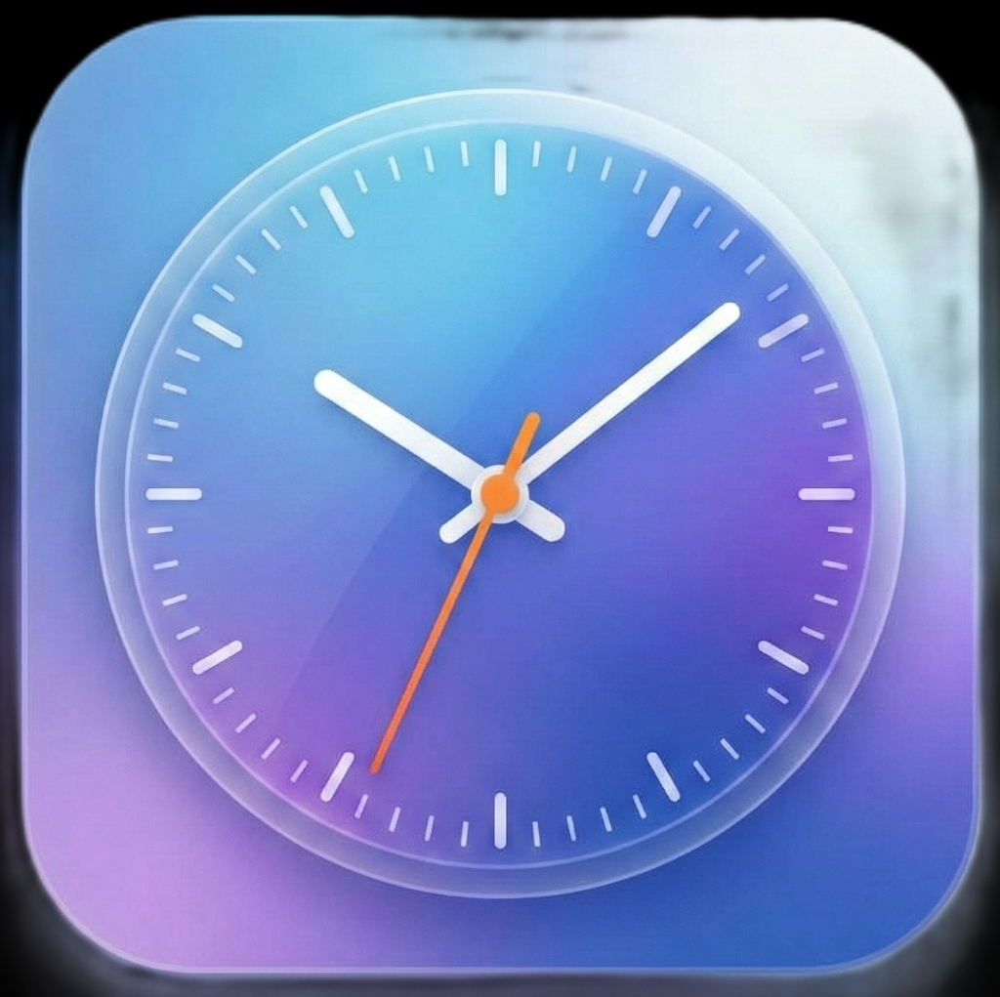
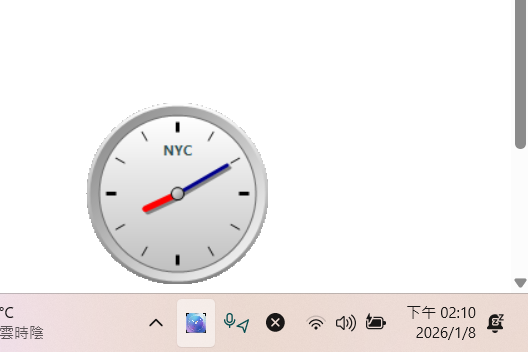

# Multi-Clock



Multi-Clock is a lightweight, aesthetically pleasing Windows 11 system tray application that renders a customizable analog clock.



## Features

- **System Tray Integration**: Minimized to tray with a custom 3D blue clock icon.
- **Hover Activation**: Hover over the tray icon to view the clock window instantly. No clicks required.
- **Visual Design**:
    - **3D Aesthetics**: Metallic gradients, depth effects, and a sleek dark housing.
    - **Transparency**: Fully circular window with no square borders.
    - **Animations**: Smooth hands movement (red hour hand, dark blue minute hand).
- **Customization**:
    - **Time Zone**: Select any supported system time zone.
    - **Custom Name**: Name your clock (e.g., "NYC", "Home", "Work") to display on the face.
    - **Persistence**: Settings are saved and restored automatically.

## Getting Started

### Prerequisites

- Windows OS (Windows 10/11 recommended).
- .NET Framework 4.7.2 or later (pre-installed on most modern Windows systems).

### Installation

1. Clone or download this repository.
2. Navigate to the project directory.

### Building from Source

You can compile the application using the native C# compiler (`csc.exe`) included with Windows.

Open a PowerShell or Command Prompt terminal in the project folder and run:

```powershell
C:\Windows\Microsoft.NET\Framework64\v4.0.30319\csc.exe /target:winexe /out:MultiClock.exe /r:System.Windows.Forms.dll /r:System.Drawing.dll Program.cs TrayApplicationContext.cs ClockForm.cs SettingsForm.cs
```

### Running

Double-click `MultiClock.exe` to launch the application.

## Usage

1. **View Clock**: Move your mouse cursor over the Multi-Clock tray icon.
2. **Adjust Settings**: Right-click the tray icon and select **Adjust**.
    - Choose a Time Zone.
    - Enter a name (max 10 chars).
    - Click **Set**.
3. **Exit**: Right-click the tray icon and select **Exit**.

## System Tray Visibility

If the clock icon is hidden in the "overflow" menu (the `^` arrow), you can force it to always show:

1. Right-click the **Taskbar** and select **Taskbar settings**.
2. Scroll down and expand **Other system tray icons**.
3. Find **Multi-Clock** in the list.
4. Toggle the switch to **On**.

## License

This project is open source.
